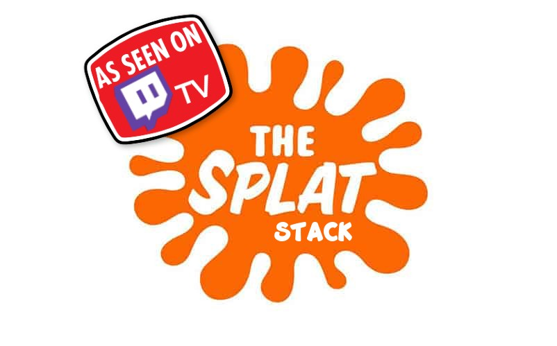

<div align="center">
  
  <h3>SPLAT</h3>
  <p>
    A project template to get started with the SPLAT stack (SvelteKit, Prisma, Lucia (Auth), TailwindCSS)
  </p>
</div>

### Project Setup

Clone this repo (eg: using Github CLI below) and install packages with npm (or pnpm, etc.)
```bash
gh repo clone zeucapua/splat-template
cd splat-template
npm install
```

Edit `.env` with Database URL and OAuth (eg: Postgres, Discord OAuth)
```
DATABASE_URL=<postgres:url>
DISCORD_CLIENT_ID=<from discord.com/developers>
DISCORD_CLIENT_SECRET=<from discord.com/developers>
```

Run Prisma to shape database and generate client
```bash
npx prisma db push
```

Run website locally
```bash
npm run dev
```
